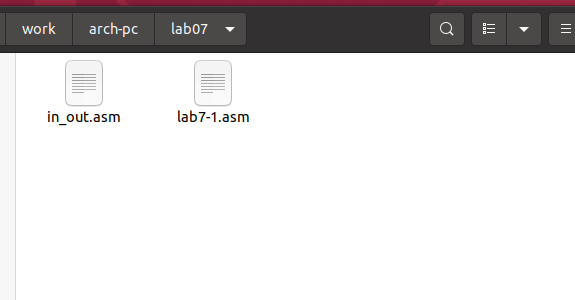
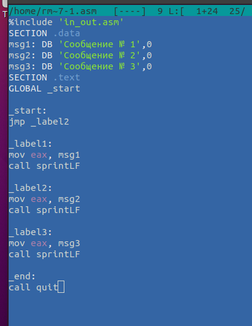
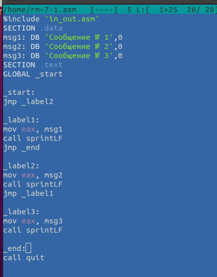
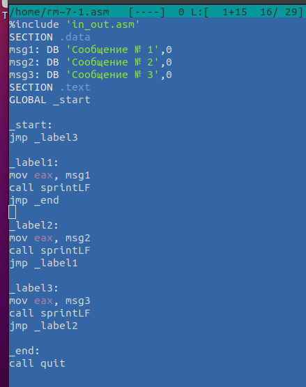
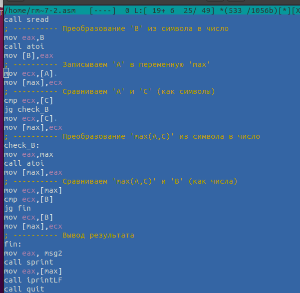
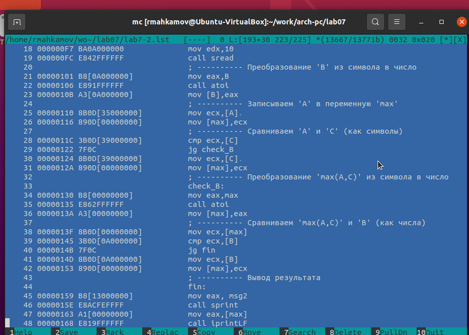
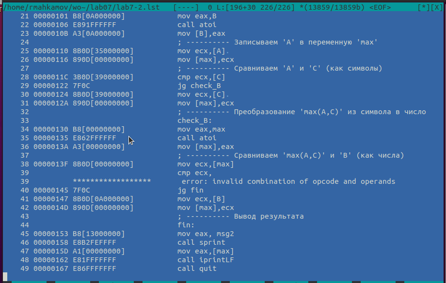
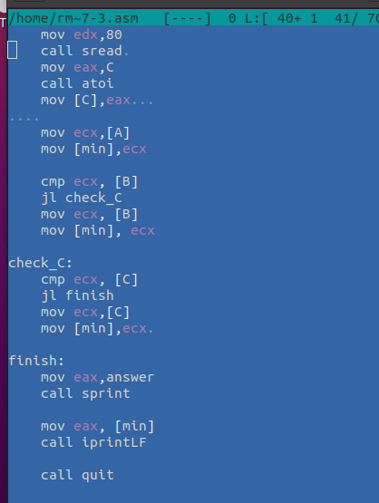
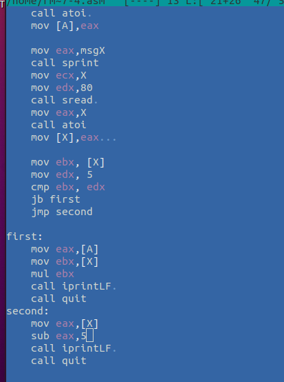

---
## Front matter
title: "Отчёт по лабораторной работе 7"
subtitle: "дисциплина:	Архитектура компьютера"
author: "Миази Мд Шахадат Хоссейн - НКАбд-03-24"

## Generic otions
lang: ru-RU
toc-title: "Содержание"

## Bibliography
bibliography: bib/cite.bib
csl: pandoc/csl/gost-r-7-0-5-2008-numeric.csl

## Pdf output format
toc: true # Table of contents
toc-depth: 2
lof: true # List of figures
lot: true # List of tables
fontsize: 12pt
linestretch: 1.5
papersize: a4
documentclass: scrreprt
## I18n polyglossia
polyglossia-lang:
  name: russian
  options:
	- spelling=modern
	- babelshorthands=true
polyglossia-otherlangs:
  name: english
## I18n babel
babel-lang: russian
babel-otherlangs: english
## Fonts
mainfont: PT Serif
romanfont: PT Serif
sansfont: PT Sans
monofont: PT Mono
mainfontoptions: Ligatures=TeX
romanfontoptions: Ligatures=TeX
sansfontoptions: Ligatures=TeX,Scale=MatchLowercase
monofontoptions: Scale=MatchLowercase,Scale=0.9
## Biblatex
biblatex: true
biblio-style: "gost-numeric"
biblatexoptions:
  - parentracker=true
  - backend=biber
  - hyperref=auto
  - language=auto
  - autolang=other*
  - citestyle=gost-numeric
## Pandoc-crossref LaTeX customization
figureTitle: "Рис."
tableTitle: "Таблица"
listingTitle: "Листинг"
lofTitle: "Список иллюстраций"
lotTitle: "Список таблиц"
lolTitle: "Листинги"
## Misc options
indent: true
header-includes:
  - \usepackage{indentfirst}
  - \usepackage{float} # keep figures where there are in the text
  - \floatplacement{figure}{H} # keep figures where there are in the text
---

# Цель работы

Целью работы является изучение команд условного и безусловного переходов. Приобретение навыков написания программ с использованием переходов. Знакомство с назначением и структурой файла листинга.

# Теоретическое введение

## Команды перехода

Для реализации ветвлений в ассемблере используются так называемые команды передачи
управления или команды перехода. Можно выделить 2 типа переходов:

* условный переход – выполнение или не выполнение перехода в определенную точку программы в зависимости от проверки условия.

* безусловный переход – выполнение передачи управления в определенную точку программы без каких-либо условий.

Безусловный переход выполняется инструкцией jmp (от англ. jump – прыжок), которая включает в себя адрес перехода, куда следует передать управление.

Как отмечалось выше, для условного перехода необходима проверка какого-либо условия.
В ассемблере команды условного перехода вычисляют условие перехода анализируя флаги
из регистра флагов.

Инструкция cmp является одной из инструкций, которая позволяет сравнить операнды и
выставляет флаги в зависимости от результата сравнения.
Инструкция cmp является командой сравнения двух операндов и имеет такой же формат,
как и команда вычитания.

## Листинг

Листинг (в рамках понятийного аппарата NASM) — это один из выходных файлов, созда-
ваемых транслятором. Он имеет текстовый вид и нужен при отладке программы, так как
кроме строк самой программы он содержит дополнительную информацию.

Итак, структура листинга:

* номер строки — это номер строки файла листинга (нужно помнить, что номер строки в файле листинга может не соответствовать номеру строки в файле с исходным текстом программы);

* адрес — это смещение машинного кода от начала текущего сегмента;

* машинный код представляет собой ассемблированную исходную строку в виде шестнадцатеричной последовательности. (например, инструкция int 80h начинается по смещению 00000020 в сегменте кода; далее идёт машинный код, в который ассемблируется инструкция, то есть инструкция int 80h ассемблируется в CD80 (в шестнадцатеричном представлении); CD80 — это инструкция на машинном языке, вызывающая прерывание ядра)

*  исходный текст программы — это просто строка исходной программы вместе с комментариями (некоторые строки на языке ассемблера, например, строки, содержащие только комментарии, не генерируют никакого машинного кода, и поля «смещение» и «исходный текст программы» в таких строках отсутствуют, однако номер строки им присваивается)

# Выполнение лабораторной работы

## Реализация переходов в NASM

Создаю каталог для программ лабораторной работы № 7 и файл lab7-1.asm. (рис. { #fig:001 width=70%, height=70% })

Инструкция jmp в NASM используется для реализации безусловных переходов. Рассмотрим пример программы с использованием инструкции jmp. Написал в файл lab7-1.asm текст программы из листинга 7.1. (рис. { #fig:002 width=70%, height=70% })

Создаю исполняемый файл и запускаю его. (рис. { #fig:003 width=70%, height=70% })

Инструкция jmp позволяет осуществлять переходы не только вперед, но и назад. Изменяю программу таким образом, чтобы она выводила сначала «Сообщение № 2», затем «Сообщение № 1», и завершала работу. Для этого после вывода сообщения № 2 добавляю инструкцию jmp с меткой _label1 (переход к инструкциям вывода сообщения № 1), и после вывода сообщения № 1 добавляю инструкцию jmp с меткой _end (переход к инструкции call quit).

Изменяю текст программы в соответствии с листингом 7.2. (рис. { #fig:004 width=70%, height=70% }) (рис. { #fig:005 width=70%, height=70% })

После изменений программа выводит следующее: Сообщение № 3 Сообщение № 2 Сообщение № 1

(рис. { #fig:006 width=70%, height=70% }) (рис. { #fig:007 width=70%, height=70% })

Использование инструкции jmp приводит к переходу в любом случае. Однако, часто при написании программ необходимо использовать условные переходы, то есть переход должен осуществляться только при выполнении определенного условия. В качестве примера рассмотрим программу, которая определяет и выводит на экран наибольшее из трех целочисленных переменных: A, B и C. Значения для A и C задаются в программе, значение B вводится с клавиатуры.

Создаю исполняемый файл и проверяю его работу для различных значений B (рис. { #fig:008 width=70%, height=70% }) (рис. { #fig:009 width=70%, height=70% })

## Изучение структуры файла листинга

Обычно nasm создает в результате ассемблирования только объектный файл. Чтобы получить файл листинга, необходимо указать ключ -l и задать имя файла листинга в командной строке.

Создаю файл листинга для программы из файла lab7-2.asm. (рис. { #fig:010 width=70%, height=70% })

Ознакомимся с его форматом и содержимым.

- строка 211:
  - 34 - номер строки
  - 0000012E - адрес
  - B8[00000000] - машинный код
  - mov eax,max - код программы
- строка 212:
  - 35 - номер строки
  - 00000133 - адрес
  - E864FFFFFF - машинный код
  - call atoi - код программы
- строка 213:
  - 36 - номер строки
  - 00000138 - адрес
  - A3[00000000] - машинный код
  - mov [max],eax - код программы

Открываю файл с программой lab7-2.asm и удаляю один операнд из инструкции с двумя операндами. Затем выполняю трансляцию с получением файла листинга. (рис. { #fig:011 width=70%, height=70% }) (рис. { #fig:012 width=70%, height=70% })

Объектный файл не смог создаться из-за ошибки, но файл листинга с выделенным местом ошибки был получен.

## Самостоятельное задание

Напишите программу нахождения наименьшей из трех целочисленных переменных a, b и c. Значения переменных выбрать из таблицы 7.5 в соответствии с вариантом, полученным при выполнении лабораторной работы № 6. Создаю исполняемый файл и проверяю его работу (рис. { #fig:013 width=70%, height=70% }) (рис. { #fig:014 width=70%, height=70% })

Для варианта 12 - 99,29,26

Напишите программу, которая для введенных с клавиатуры значений x и a вычисляет значение заданной функции f(x) и выводит результат вычислений. Вид функции f(x) выбрать из таблицы 7.6 вариантов заданий в соответствии с вариантом, полученным при выполнении лабораторной работы № 7. Создаю исполняемый файл и проверяю его работу для значений X и a из 7.6. (рис. { #fig:015 width=70%, height=70% }) (рис. { #fig:016 width=70%, height=70% })

Для варианта 12:

$$
\begin{cases}
    xa, &  x < 5 \\
    x-5, & x \ge 5
\end{cases}
$$

При (x = 3, a = 7) получается 21

При (x = 6, a = 4) получается 1

# Выводы

Изучили команды условного и безусловного переходов, познакомились с фалом листинга.